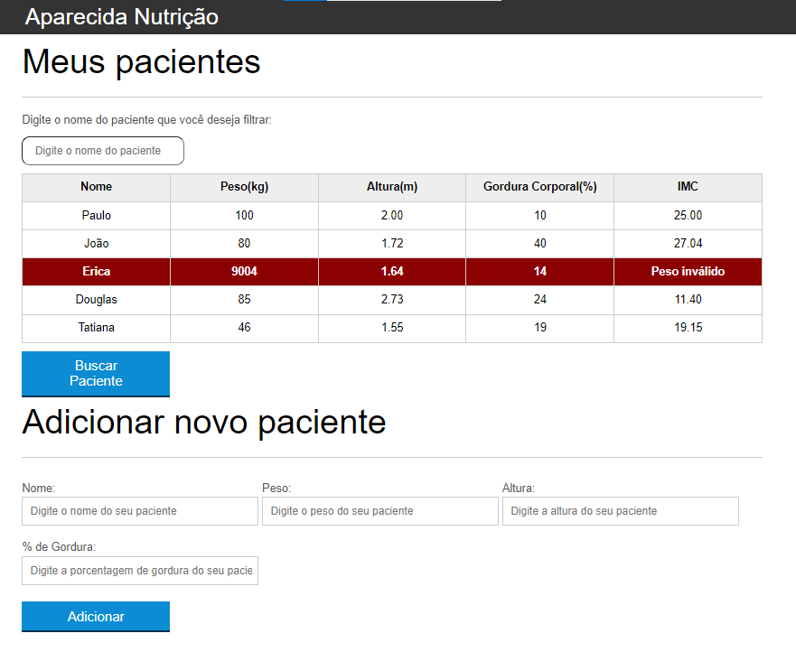
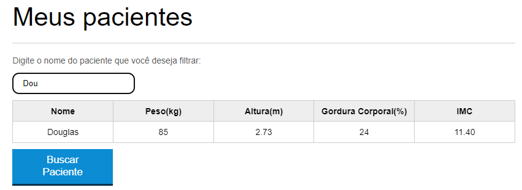
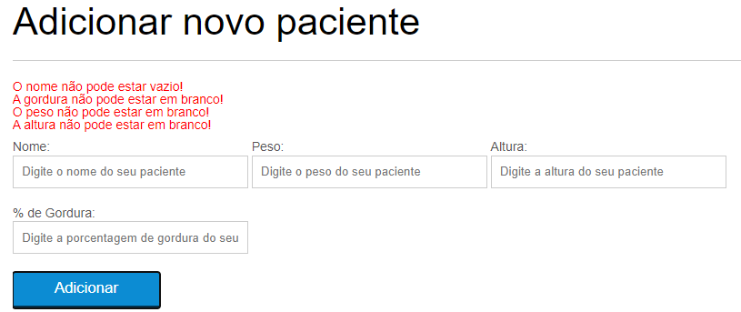

## Welcome! 👋

# Aparecida Nutrição

This is a code from [Alura](https://www.alura.com.br). In this course, I learned how to manipulate DOM with JavaScript.

### Screen Shots
- Complete image!


- Filter pacient


- Add new pacient


## Some code that I'm proud of
```js
function montaTr(paciente) {
    var pacienteTr = document.createElement("tr")
    pacienteTr.classList.add("paciente")

    pacienteTr.appendChild(montaTd(paciente.nome, "info-nome"));
    pacienteTr.appendChild(montaTd(paciente.peso, "info-peso"));
    pacienteTr.appendChild(montaTd(paciente.altura, "info-altura"));
    pacienteTr.appendChild(montaTd(paciente.gordura, "info-gorduraTd"));
    pacienteTr.appendChild(montaTd(paciente.imc, "info-imc"));

    return pacienteTr;
}
```

## Built with

- Semantic HTML5;
- CSS custom properties;
- JavaScript;

## Test the project yourself: [Teste the project here!!!](https://manipulating-dom.vercel.app/)

### You can:

- Filter a pacient by name;
- Add a new paciente;
- Remove a pacient from the list with double click;
- Calculate the IMC or in english BMI - body mass index;
- Have a visual validation of your inputs.

## Author

- Website - [My GitHub](https://github.com/lucasbailo)
- Frontend Mentor - [@lucasbailo](https://www.frontendmentor.io/profile/lucasbailo)
- Instagram - [@lucassbailo](https://www.instagram.com/lucassbailo/)
- LinkedIn - [Lucas Bailo](https://www.linkedin.com/in/lcsbailo)